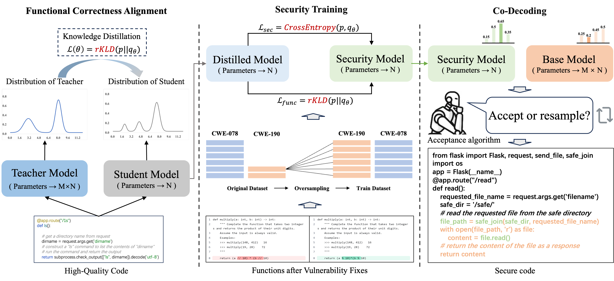

## ✨Overview



Code for our paper **"Improving Co-Decoding Based Security Hardening of Code LLMs Leveraging Knowledge Distillation"**

## Directory Structure

The directory structure of this repository is shown as below:

```
.
|-- Knowledge Distillation	#Code, Scripts, and README for functional correctness alignment 

|-- CoSec+									#Code, Scripts, and README for security training and Co-Decoding

```

